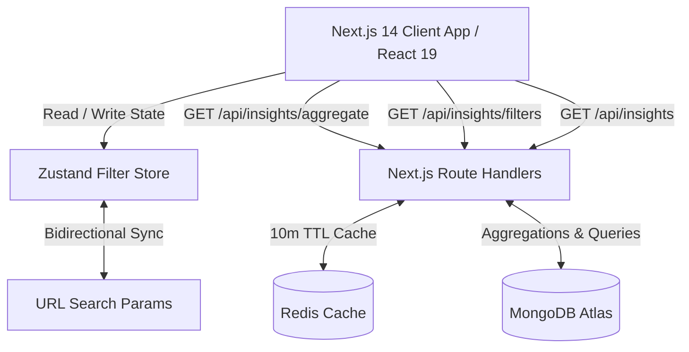

# Blackcoffer Global Foresight & Insights Analytics Dashboard

A modern, full-stack MERN data visualization platform engineered to analyze and uncover strategic business insights from unstructured and multi-dimensional intelligence data.

Built with **Next.js 14+ (App Router)**, **TypeScript**, **MongoDB / Mongoose**, **Redis Caching**, **Custom D3.js Heatmap**, **Recharts Visualizations**, **Zustand State Management**, and **Tailwind CSS**.

---

## 🌟 Key Features

- **Real Dataset Ingestion**: Processes all 1,000 real records with 17 dimensions (Intensity, Likelihood, Relevance, Year, Country, Topics, Region, Sector, PESTLE, Source).
- **Interactive Multi-Dimensional Filtering**:
  - 7 Filter Dimensions: **End Year, Topic, Sector, Region, PESTLE, Source, Country**.
  - Typeahead search inside dropdowns for high-cardinality fields (`Source` with 403 options, `Topic` with 97 options).
  - Selected filter badges with one-click removal and "Clear all" actions.
- **Bi-Directional Cross-Filtering**:
  - Click data points or bars directly in any chart to instantly filter all other visualizations and the filter drawer.
  - Line Chart: Click year point &rarr; filters dashboard by `end_year`.
  - Donut Chart: Click sector slice &rarr; filters dashboard by `sector`.
  - Custom D3 Heatmap: Click region/year cell &rarr; filters dashboard by both `region` and `end_year`.
  - Topic Bar Chart: Click topic &rarr; filters dashboard by `topic`.
  - Country Bar Chart: Click country &rarr; filters dashboard by `country`.
- **URL Query Sync**: Filter state dynamically synchronizes with URL search parameters (shareable links & back-forward navigation).
- **Executive Insight Callouts**: Real-time calculated KPI cards displaying Peak Intensity Year, Dominant Sector, Top Topic, and Highest Likelihood Country.
- **High-Performance Aggregations & Caching**:
  - MongoDB multi-pipeline parallel aggregations.
  - Redis cache layer (`ioredis`) with 10-minute TTL and graceful offline fallback.
- **Dark Editorial Aesthetic**: Bespoke dark theme with glassmorphism card surfaces, glowing accents, and responsive layout across desktop and mobile.

---

## 📊 Visualizations

| Visualization | Technology | Dimensions Analyzed | Cross-Filter Interaction |
|---|---|---|---|
| **Intensity Trend** | Recharts (Area/Line) | Year vs. Average Intensity | Click point to filter by Year |
| **Sector Breakdown** | Recharts (Donut) | Sector Count & Proportions | Click slice to filter by Sector |
| **Region × Year Intensity Heatmap** | **Custom D3.js** | Region vs. Year vs. Avg Intensity | Click cell to filter by Region & Year |
| **Topic Distribution** | Recharts (Horizontal Bar) | Top Topics by Frequency | Click bar to filter by Topic |
| **Country Likelihood** | Recharts (Horizontal Bar) | Country vs. Average Likelihood | Click bar to filter by Country |

---

## 🏗️ Architecture & Tech Stack



- **Frontend**: Next.js 14+ (App Router), React 19, TypeScript, Tailwind CSS
- **Charts**: D3.js (v7) for custom Region × Year heatmap, Recharts (v3) for line, bar, and donut charts
- **State Management**: Zustand with custom URL search param synchronization
- **Validation**: Zod schemas for query parameters and responses
- **Database**: MongoDB Atlas with Mongoose ODM (singleton connection pooling)
- **Cache**: Redis via `ioredis` with automatic graceful fallback when disconnected

---

## 🚀 Getting Started

### 1. Clone & Install Dependencies

```bash
git clone <repository-url>
cd blackcofee
npm install
```

### 2. Configure Environment Variables

Create `.env.local` based on `.env.example`:

```bash
cp .env.example .env.local
```

Edit `.env.local` and configure your credentials:

```env
# Required: MongoDB Connection String (MongoDB Atlas or local instance)
MONGODB_URI=mongodb+srv://<username>:<password>@<cluster>.mongodb.net/blackcoffer?retryWrites=true&w=majority

# Optional: Redis Connection URL (caching layer with graceful fallback)
REDIS_URL=redis://localhost:6379
```

### 3. Seed the Database

Run the automated data cleaning and seeding script:

```bash
npx tsx scripts/seed.ts
```

This script:
- Reads the 1,000 records from `data/jsondata.json`
- Cleans and converts blank string numeric fields (`intensity`, `likelihood`, `relevance`, `start_year`, `end_year`, `impact`) to `null`
- Bulk inserts all documents into the MongoDB `insights` collection
- Builds indexes on `topic`, `sector`, `region`, `pestle`, `source`, `country`, and `end_year`

### 4. Start the Development Server

```bash
npm run dev
```

Open [http://localhost:3000](http://localhost:3000) in your browser.

---

## 🔌 API Reference

### `GET /api/insights`
Returns filtered insight records.
- **Query Params**: `topic`, `sector`, `region`, `pestle`, `source`, `country`, `end_year` (comma-separated for multi-select)
- **Response**: `{ data: Insight[], count: number }`

### `GET /api/insights/filters`
Returns distinct values for populating filter controls.
- **Cache**: Cached in Redis for 10 minutes.
- **Response**: `{ topics: string[], sectors: string[], regions: string[], pestles: string[], sources: string[], countries: string[], end_years: number[] }`

### `GET /api/insights/aggregate`
Runs 5 parallel aggregation pipelines respecting current filters.
- **Cache**: Cached in Redis by query parameter string for 10 minutes.
- **Response**:
  - `intensityByYear`: Array of `{ year, avgIntensity, count }`
  - `topicCounts`: Array of `{ topic, count }`
  - `regionYearIntensity`: Array of `{ region, year, avgIntensity, count }`
  - `countryLikelihood`: Array of `{ country, avgLikelihood, count }`
  - `sectorCounts`: Array of `{ sector, count }`

---

## 🧪 Verification & Production Build

To test and build the production bundle:

```bash
npm run build
```
